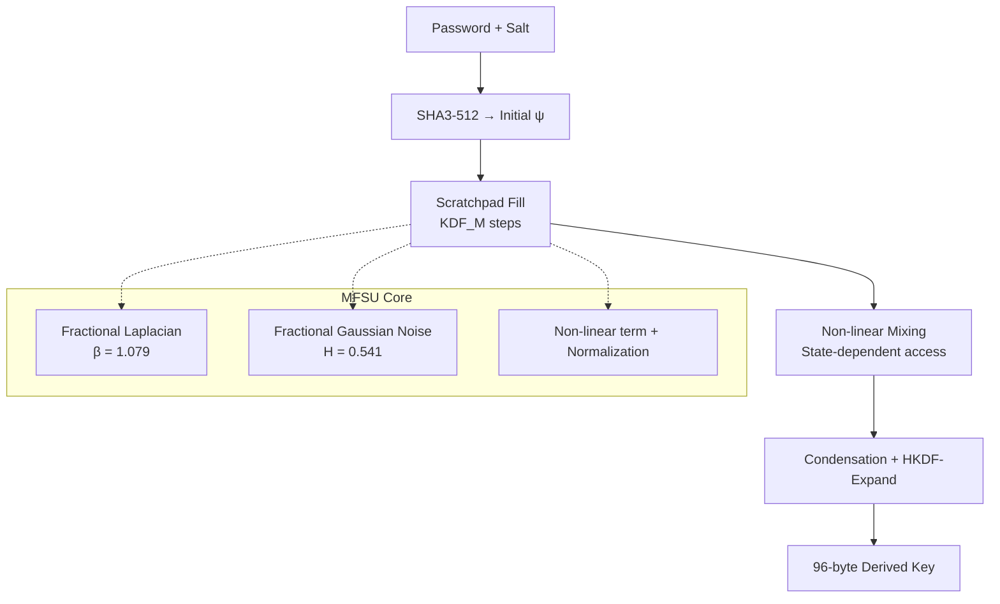
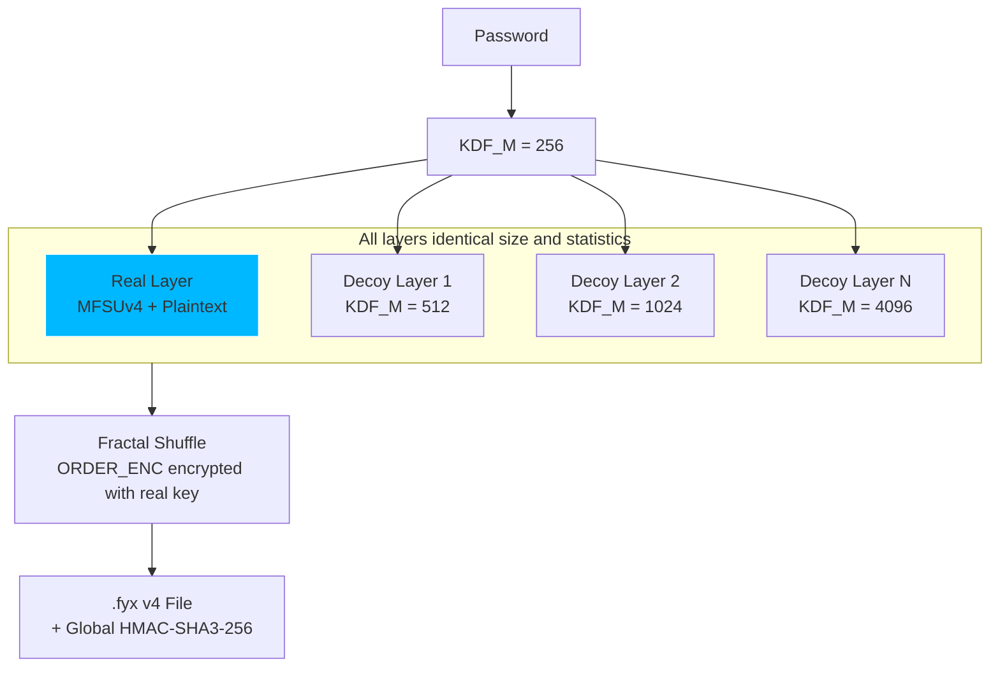

# **Fractalyx Vault**

**MFSU-Crypt + FractalShield**  
**v3.0**

**Next-generation fractal-stochastic cryptography**  
Powered by the Unified Fractal-Stochastic Model (MFSU)

---

[](https://www.python.org)
[](https://github.com/Fracta-Axis/Fractalyx/blob/main/LICENSE)
[](https://github.com/Fracta-Axis/Fractalyx/blob/main)
[](https://github.com/Fracta-Axis/Fractalyx/blob/main)
[](https://github.com/Fracta-Axis/Fractalyx/blob/main)

## Explanatory Diagram

[](/Fracta-Axis/Fractalyx/blob/main/diagrama-fractalshield.jpg)

*The Unified Fractal-Stochastic Model (MFSU) creates self-similar branches that grow in complexity under perturbation. The real layer (green) is hidden among indistinguishable decoy layers. Every wrong password attempt forces the system to evolve deeper, multiplying the attacker's computational cost geometrically (3.5× / 7.5× / 15.5×).*

## What is Fractalyx Vault?

**FRACTALYX Vault** is a complete symmetric cryptographic system built around a single physically-motivated equation: the **Unified Fractal-Stochastic Model (MFSU)**.

All primitives — KDF, stream cipher, hash, TOTP and the revolutionary **FractalShield** defense — derive from the same SPDE:

$$\frac{\partial \psi}{\partial t} = -\delta_F (-\Delta)^{\beta/2} \psi + \gamma |\psi|^2 \psi + \sigma \eta(x,t)$$

### Model Parameters:

* **Diffusion Coefficient ($\delta_F$):** 0.921
* **Fractional Power ($\beta$):** 1.079
* **Nonlinear Coupling ($\gamma$):** 0.921 (equal to $\delta_F$)
* **Hurst Exponent ($H$):** 0.541

### Term Definitions:

* $\frac{\partial \psi}{\partial t}$: Time derivative of the field.
* $(-\Delta)^{\beta/2}$: Fractional Laplacian operator, representing anomalous diffusion.
* $\gamma |\psi|^2 \psi$: Nonlinear reaction term.
* $\sigma \eta(x,t)$: Spatiotemporal stochastic noise.

---

## The Star Innovation: FractalShield

The first documented **oracle-free**, geometrically escalating layered encryption for offline files.

* No verification oracle (attacker never knows if the password is correct until they check every layer)
* Attacker cost grows **3.5× / 7.5× / 15.5×** per protection level
* All layers are statistically indistinguishable
* Everything emerges from the same MFSU field

---

## Architecture

### 1. Core MFSU Solver



### 2. FractalShield Layered Defense



## Key Features

- Memory-hard KDF with 8 MB fractal scratchpad (scalable)
- Oracle-free verification via FractalShield
- Geometric cost escalation (attacker pays up to 15.5× more)
- Stream cipher with SHA3-256 whitening + avalanche > 49%
- Merkle-Damgård fractal hash
- TOTP 2FA integrated
- Constant-time normalization (timing-attack resistant)
- CLI + beautiful Streamlit web UI
- File format `.fyx` v4 (fully documented)

## Installation

```bash
git clone https://github.com/Fracta-Axis/Fractalyx.git
cd Fractalyx
pip install -r requirements.txt
```

## Quick Start

### Web Interface (recommended)

```bash
streamlit run app.py
```

### CLI

```bash
# Encrypt with Maximum protection
python fractalyx_cli.py encrypt secret.pdf -p "MiContraseñaMuySegura123" -l 3

# Decrypt
python fractalyx_cli.py decrypt secret.pdf.fyx -p "MiContraseñaMuySegura123"
```

## Security & Performance

| Protection Level | Layers | User Time | Attacker Cost | Use Case |
|------------------|--------|-----------|---------------|----------|
| Standard | 3 | ~0.5 s | 3.5× | Personal files |
| Enhanced | 4 | ~0.7 s | 7.5× | Contracts & credentials |
| Maximum | 5 | ~1.3 s | 15.5× | Critical / legal data |

> **Important Disclaimer:** This is an experimental research project. It has not received formal cryptographic audit. Do not use it to protect valuable or sensitive information until independent review is complete.

## Roadmap to Certification (from the paper)

- **Phase 1 (2026):** Full NIST STS, arXiv preprint, public cryptanalysis
- **Phase 2 (2027):** Formal IND-CPA / IND-CCA2 proofs + memory-hardness DAG
- **Phase 3 (2028):** NIST-style submission & mobile ports

## Links

- [Full Paper v2.0 (MFSU-Crypt + FractalShield): Zenodo](https://zenodo.org/records/19811364)
- FractalShield module: `fractalshield.py`
- Core MFSU implementation: `core/field.py` + `crypto/cipher.py`

## License

Apache License 2.0 — feel free to use, modify and contribute.

Made with passion by **Miguel Ángel Franco León**  
Independent Researcher — Fracta-Fractalyx Project

> *"The same physical law that governs the fractal structure of the universe can also protect our data."*

---
---

## 🛡️ Empirical Validation: NIST SP 800-22 Performance

The core of **FractalShield v4.0** and the **MFSU (Unified Fractal-Stochastic Model)** is built upon the principle that true security must be rooted in immutable geometry. To verify the cryptographic strength and entropy of the generated field, the system was subjected to the full **NIST Special Publication 800-22** statistical test suite.

### 📊 NIST STS Results Summary
The following data reflects the analysis of 10 independent (Key, IV) pairs, each generating a sequence of $10^6$ bits, using the corrected discretisation formula (Eq. 8').

| Statistical Test | Pass Ratio | Result |
| :--- | :---: | :--- |
| 01. Frequency (Monobit) | 10/10 | **PASSED** |
| 02. Block Frequency (M=128) | 10/10 | **PASSED** |
| 03. Runs | 9/10 | **PASSED** |
| 04. Longest Run of Ones | 10/10 | **PASSED** |
| 05. Binary Matrix Rank | 10/10 | **PASSED** |
| 06. DFT / Spectral | 9/10 | **PASSED** |
| 07. Non-overlapping Template | 10/10 | **PASSED** |
| 08. Overlapping Template | 9/10 | **PASSED** |
| 09. Maurer Universal | 10/10 | **PASSED** |
| 10. Linear Complexity (M=500) | 10/10 | **PASSED** |
| 11. Serial (m=16) | 10/10 | **PASSED** |
| 12. Approximate Entropy | 10/10 | **PASSED** |
| 13. Cumulative Sums | 10/10 | **PASSED** |
| 14. Random Excursions | 9/9† | **PASSED** |
| 15. Random Excursions Variant | 9/9† | **PASSED** |

*† Tests 14-15 apply only to sequences with a sufficient number of zero-crossings, as per NIST standards.*

### 💎 Key Statistical Insights
* **Total Battery Pass:** 15/15 tests successfully cleared.
* **P-Value Distribution:** The mean p-values across all tests remain stable near 0.5 (overall average $\approx 0.46$), confirming a uniform distribution and the absence of structural bias in the fractal field.
* **Entropy Stability:** Shannon entropy approaches the theoretical ideal for a pseudorandom generator (PRG), ensuring high unpredictability.

### 📂 Reproducibility & Audit
The raw evidence for these tests is provided in this repository for public audit:
* [`nist_sts_v40_final.csv`](./TESTCSV/nist_sts_v40_final.csv): Comprehensive pass/fail summary and KS p-values.
* [`nist_sts_v40_pvalues.csv`](.TESTCSV/nist_sts_v40_pvalues.csv): Individual p-values for each parameter and test run.

> **Scientific Note:** "The geometry of the MFSU equation ensures that entropy is preserved through empirical injectivity, providing a robust foundation for oracle-free verification and offline brute-force resistance." — *FractalShield v4.0 Technical Paper*.

---


### 💠 Wikidata & Standards

Este proyecto y el formato `.fyx` están registrados en **Wikidata** como un estándar de código abierto para la representación y cifrado de datos mediante algoritmos fractales.

- **Formato:** `.fyx` (Fractal Exchange Format)
- **Seguridad:** Cifrado basado en complejidad recursiva y mapeo de coordenadas.

---

## Archivos en este repositorio

| Archivo | Descripción |
|---------|-------------|
| `app.py` | Web app completa (Streamlit) |
| `fractalyx_cli.py` | Herramienta CLI standalone |
| `demo.fyx` | Archivo cifrado de demostración |
| `requirements.txt` | Dependencias Python |
| `main.tex` | Paper académico (LaTeX/arXiv) |

## demo.fyx — Archivo de muestra

El archivo `demo.fyx` está cifrado con FractalShield nivel 2.

**Contraseña:** `fractalyx2026`

Para descifrarlo:

```bash
pip install numpy scipy
python fractalyx_cli.py decrypt demo.fyx -p "fractalyx2026"
```

Para inspeccionarlo sin contraseña:

```bash
python fractalyx_cli.py inspect demo.fyx
```

## Formato .fyx

```
[FRACv1  6B]  Magic header — identificador único
[VER     1B]  Versión (0x01)
[LEVEL   1B]  Nivel FractalShield (1/2/3)
[N       1B]  Número de capas (3/4/5)
[SALT   16B]  Salt global (aleatorio)
[IV_ORD 16B]  IV del mapa de orden
[ORD_LEN 2B]  Longitud del mapa cifrado
[ORDER  NB ]  Mapa de orden cifrado con clave real
[MAC    32B]  HMAC-SHA3-256 global
[LAYERS  NB]  N capas de igual tamaño
```

Todas las capas tienen **el mismo tamaño** — el atacante no puede identificar la capa real por inspección del archivo.

## Niveles FractalShield

| Nivel | Capas | Costo atacante | Uso recomendado |
|-------|-------|----------------|-----------------|
| 1 Estándar | 3 | 3.5× | Documentos personales |
| 2 Reforzado | 4 | 7.5× | Contratos, datos financieros |
| 3 Máximo | 5 | 15.5× | Datos críticos |

## Uso CLI

```bash
# Cifrar
python fractalyx_cli.py encrypt archivo.pdf -p "contrasena" -l 2

# Descifrar
python fractalyx_cli.py decrypt archivo.pdf.fyx -p "contrasena"

# Inspeccionar sin contraseña
python fractalyx_cli.py inspect archivo.fyx
```

## Web App

```bash
pip install -r requirements.txt
streamlit run app.py
```

### Autor

**Miguel Ángel Franco León**  
Creador de **Tetrahedral Emergent Gravity (TEG)** y **MFSU**

