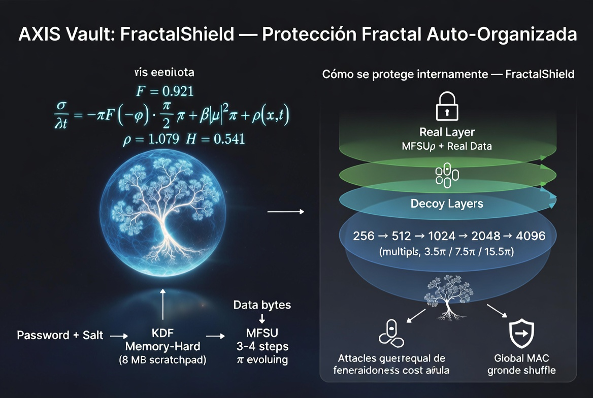

[](https://github.com/Fracta-Axis/Axis)

<div align="center">

# **AXIS Vault**  
**MFSU-Crypt + FractalShield**  
**v3.0**

**Next-generation fractal-stochastic cryptography**  
Powered by the Unified Fractal-Stochastic Model (MFSU)

</div>

---


[](https://www.python.org)
[](LICENSE)
[]()
[]()
[]()


## Explanatory Diagram



*The Unified Fractal-Stochastic Model (MFSU) creates self-similar branches that grow in complexity under perturbation. The real layer (green) is hidden among indistinguishable decoy layers. Every wrong password attempt forces the system to evolve deeper, multiplying the attacker’s computational cost geometrically (3.5× / 7.5× / 15.5×).*

## What is AXIS Vault?

**AXIS Vault** is a complete symmetric cryptographic system built around a single physically-motivated equation: the **Unified Fractal-Stochastic Model (MFSU)**.

All primitives — KDF, stream cipher, hash, TOTP and the revolutionary **FractalShield** defense — derive from the same SPDE:

$$
\frac{\partial \psi}{\partial t} = -\delta_F (-\Delta)^{\beta/2} \psi + \gamma |\psi|^2 \psi + \sigma \eta(x,t)
$$

with $\delta_F = 0.921$, $\beta = 1.079$, $\gamma = \delta_F$, $H = 0.541$.

### The Star Innovation: FractalShield
The first documented **oracle-free, geometrically escalating layered encryption** for offline files.

- No verification oracle (attacker never knows if the password is correct until they check every layer)
- Attacker cost grows **3.5× / 7.5× / 15.5×** per protection level
- All layers are statistically indistinguishable
- Everything emerges from the same MFSU field

---

## Architecture

### 1. Core MFSU Solver
```mermaid
flowchart TD
    A[Password + Salt] --> B[SHA3-512 → Initial ψ]
    B --> C[Scratchpad Fill\nKDF_M steps]
    C --> D[Non-linear Mixing\nState-dependent access]
    D --> E[Condensation + HKDF-Expand]
    E --> F[96-byte Derived Key]
    subgraph MFSU Core
        G[Fractional Laplacian\nβ = 1.079]
        H[Fractional Gaussian Noise\nH = 0.541]
        I[Non-linear term + Normalization]
    end
    C -.-> G & H & I

2. FractalShield Layered Defensemermaid

flowchart TD
    P[Password] --> KDF[KDF_M = 256]
    KDF --> Real[Real Layer\nMFSU\x04 + Plaintext]
    KDF --> D1[Decoy Layer 1\nKDF_M = 512]
    KDF --> D2[Decoy Layer 2\nKDF_M = 1024]
    KDF --> Dn[Decoy Layer N\nKDF_M = 4096]
    
    subgraph Layers [All layers identical size & statistics]
        Real
        D1
        D2
        Dn
    end
    
    Layers --> Shuffle[Fractal Shuffle\nORDER_ENC encrypted with real key]
    Shuffle --> File[.fracta v4 File\n+ Global HMAC-SHA3-256]
    
    style Real fill:#00b8ff,stroke:#fff

Key FeaturesMemory-hard KDF with 8 MB fractal scratchpad (scalable)
Oracle-free verification via FractalShield
Geometric cost escalation (attacker pays up to 15.5× more)
Stream cipher with SHA3-256 whitening + avalanche > 49%
Merkle-Damgård fractal hash
TOTP 2FA integrated
Constant-time normalization (timing-attack resistant)
CLI + beautiful Streamlit web UI
File format .fracta v4 (fully documented)

Installationbash

git clone https://github.com/Fracta-Axis/Axis.git
cd Axis
pip install -r requirements.txt

Quick StartWeb Interface (recommended)bash

streamlit run ui/fracts_vault.py

CLIbash

# Encrypt with Maximum protection
python -m cli --encrypt secret.pdf --password "MiContraseñaMuySegura123" --level 3

# Decrypt
python -m cli --decrypt secret.pdf.fracta --password "MiContraseñaMuySegura123"

Security & PerformanceProtection Level
Layers
User Time
Attacker Cost
Use Case
Standard
3
~0.5 s
3.5×
Personal files
Enhanced
4
~0.7 s
7.5×
Contracts & credentials
Maximum
5
~1.3 s
15.5×
Critical / legal data

Important Disclaimer
This is an experimental research project.
It has not received formal cryptographic audit.
Do not use it to protect valuable or sensitive information until independent review is complete.Roadmap to Certification (from the paper)Phase 1 (2026): Full NIST STS, arXiv preprint, public cryptanalysis
Phase 2 (2027): Formal IND-CPA / IND-CCA2 proofs + memory-hardness DAG
Phase 3 (2028): NIST-style submission & mobile ports

LinksFull Paper v2.0 (MFSU-Crypt + FractalShield): Zenodo
FractalShield module: `fractalshield.py`
Core MFSU implementation: core/field.py + crypto/cipher.py

LicenseApache License 2.0 — feel free to use, modify and contribute.Made with passion by Miguel Ángel Franco León
Independent Researcher — Fracta-Axis Project“The same physical law that governs the fractal structure of the universe can also protect our data.”

---


### Autor

**Miguel Ángel Franco León**  
Creador de **Tetrahedral Emergent Gravity (TEG)** y **MFSU**


